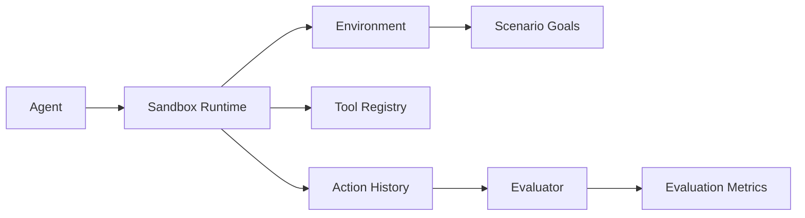

# Agent Evaluation Lab


Agent Evaluation Lab is an open sandbox for testing autonomous agents before deployment.

As more software systems embed autonomous agents, developers need a way to verify that an agent can reliably perform a job before deploying it into production environments.

Agent Evaluation Lab provides a controlled simulation environment where agents can be executed against predefined scenarios and evaluated automatically.

## Quick Start

Clone the repository and run the demo.

```bash
git clone https://github.com/joshuamlamerton/agent-evaluation-lab
cd agent-evaluation-lab
python examples/run_demo.py --env ecommerce
```

The demo runs a simple agent inside a sandbox environment and prints the final state and evaluation result.

## Example Output

```text
Final State
{'step': 2, 'inventory': ['laptop'], 'completed': True}

Action History
[{'type': 'buy', 'item': 'laptop'}, {'type': 'complete'}]

Evaluation
{'success': True, 'score': 98, 'steps': 2}
```

## Why this exists

Traditional testing tools are not designed for systems that:

- reason dynamically
- interact with tools
- operate in open-ended environments
- make decisions autonomously

Agent Evaluation Lab provides a structured environment where agents can be tested safely.

## Architecture



## Core Features

- scenario-based agent testing
- multi-step sandbox execution
- tool interaction simulation
- evaluation metrics
- dynamic environment loading

## Repository Structure

```text
agent-evaluation-lab

README.md
LICENSE

docs
  architecture.md

core
  agent_interface.py
  environment.py
  sandbox.py
  scenario.py
  tools.py
  evaluator.py
  loader.py

modules
  environments
    ecommerce
      scenario.py

examples
  run_demo.py

tests
  test_basic.py
```

## Adding a New Environment

Create a new folder under:

```text
modules/environments/
```

Example:

```text
modules/environments/research/scenario.py
```

Then run:

```bash
python examples/run_demo.py --env research
```

The system will automatically discover the environment.

Environment Interface

Each environment must expose a class called Environment.

Example structure:

modules/environments/my_environment/scenario.py

class Environment:

    def __init__(self):
        self.state = {...}

    def apply_action(self, action):
        ...
        return self.state

Once added, the environment can be executed with:

python examples/run_demo.py --env my_environment

## Roadmap

Phase 1  
Core sandbox runtime and scenario execution

Phase 2  
Tool interaction simulation and metrics

Phase 3  
Scenario library for multiple domains

Phase 4  
Benchmarking and leaderboard support

## License

Apache 2.0
